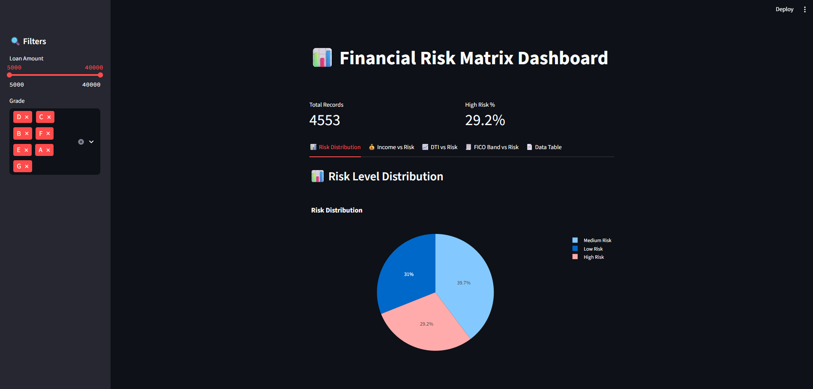
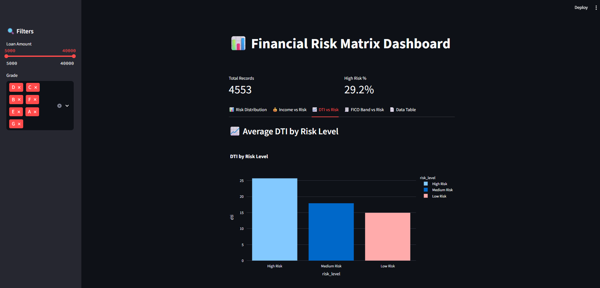
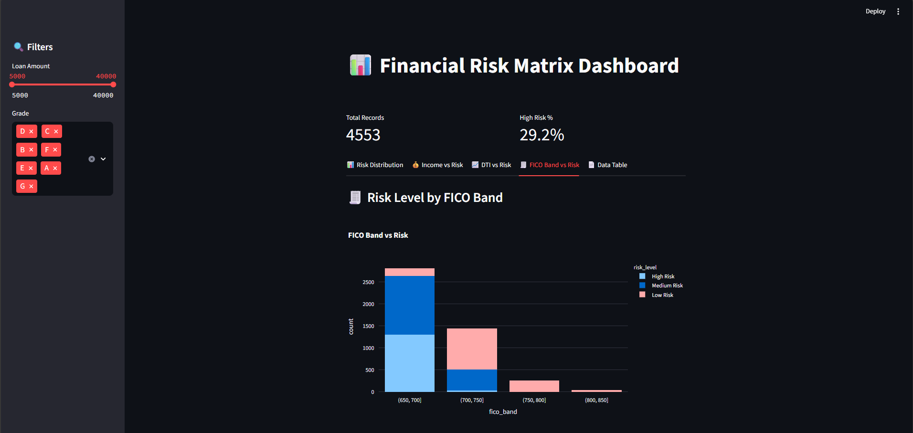
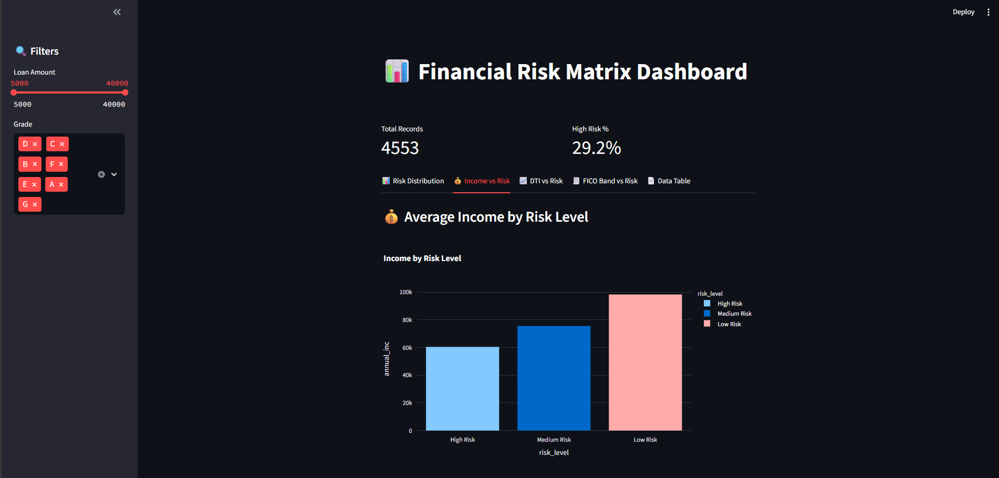

# 💼 Financial Risk Matrix Dashboard

An interactive Financial Risk Analysis Dashboard built using Python, Streamlit, Pandas, and Plotly.  
It classifies borrowers into Low, Medium, or High Risk based on income, FICO score, and DTI.

---

## Features

- Interactive dashboard with multiple charts:
  - Risk Level Distribution
  - Risk by Income
  - Risk by FICO Band
  - Average DTI by Risk
  - Average Income by Risk
- Automated risk scoring logic
- Built with Streamlit for web-based visualization

---

## 🖼️ Dashboard Previews

| Dashboard Overview | DTI vs Risk |
|------------------|-------------|
|  |  |

| FICO vs Risk | Income vs Risk |
|-------------|----------------|
|  |  |

---

## Risk Calculation Logic

Risk Score = (0.5 × (1 - FICO_norm)) + (0.3 × DTI_norm) + (0.2 × (1 - Income_norm))

| Risk Level   | Score Range |
|--------------|------------|
| Low Risk     | 0.00 – 0.33 |
| Medium Risk  | 0.34 – 0.66 |
| High Risk    | 0.67 – 1.00 |

---

## License

MIT License

---

## Author

Hem Mistry  
Mechanical Engineering Student | Data & Risk Enthusiast  
📍 India
